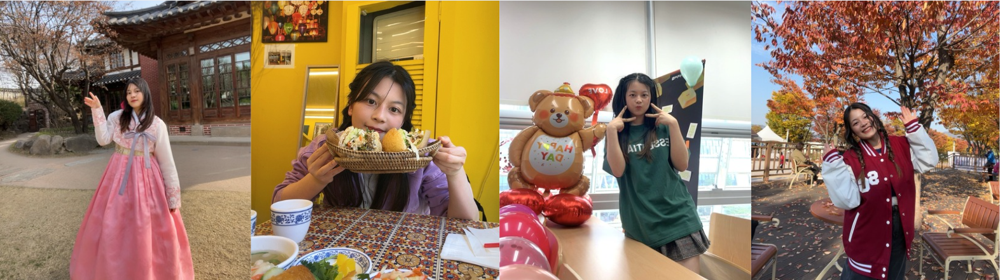

# 👋 Hi there, I'm Luna!

<h2> <strong>🥰 Introduction</strong>  </h2>

- 🤩 Full name: <b>Do Hoang Huong Lien</b>

- 🎂 Date of birth: <b>2000/12/09</b>

- ✉️ E-Mail: <b>liendhhha140217@gmail.com</b>

- 🚀 Goal: <b>Full-stack Web Developer</b>

<h2> <strong>🎓 Education</strong>  </h2>

- 👩🏻‍🎓 A Graduate Student at [Global Korean Studies](https://gks.sogang.ac.kr/english/) department of [Sogang University](https://www.sogang.ac.kr/ko/home)  
  > 
     

- 👩🏻‍💻 A Graduate Student at <b>Data Science</b> department of [Liverpool John Moores University](https://www.ljmu.ac.uk/). 
(Cyber program)

  > 
    

<h2> <strong>💭 Skills</strong>  </h2>

### <b>🧰Technical Skills</b>

  

### <b>🗣 Other Skills</b>
> 🌼 Language skills: <b>English, Korean, Vietnamese, Japanese</b> 
🌸 Soft skill: <b>Time Management, Problem-solving skills</b> 

## 💻 <b>Projects</b>

<h3><b>👨‍💻 Full Stack Web Application</b></h3>

  - [Board & Article](https://github.com/lido010209/ktech-spring-project-2.git)

    > Backend: <b>Spring boot, JPA, Spring MVC</b>

    > 
    > 
    > 
      

    > Frontend:  
    <b>Canva for design</b> 
    <b>HTML, Bootstrap for creating view</b>

    > 
    > 
    > 

    

- [Shopping mall](https://github.com/lido010209/ktech-java-project-3.git)

  > Backend: <b>Spring boot, JPA, Spring Security, RESTful API</b>

  > 
  > 
  > 
  

    

  > Frontend:  
  <b>JavaScript for fetch API</b> 
  <b>Canva for design</b> 
  <b>HTML, Bootstrap for creating view</b>

    > 
    > 
    > 
    > 

      

<h3><b>👨‍💻 Machine Learning</b></h3>

  - [Logistic regression model](https://github.com/lido010209/machine-learning.git)

    > 
    > 

<!--
**lido010209/lido010209** is a ✨ _special_ ✨ repository because its `README.md` (this file) appears on your GitHub profile.

Here are some ideas to get you started:

- 🔭 I’m currently working on ...
- 🌱 I’m currently learning ...
- 👯 I’m looking to collaborate on ...
- 🤔 I’m looking for help with ...
- 💬 Ask me about ...
- 📫 How to reach me: ...
- 😄 Pronouns: ...
- ⚡ Fun fact: ...
-->
