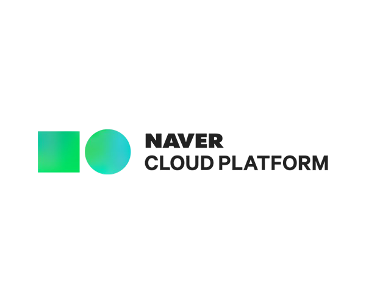
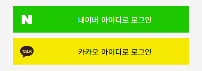
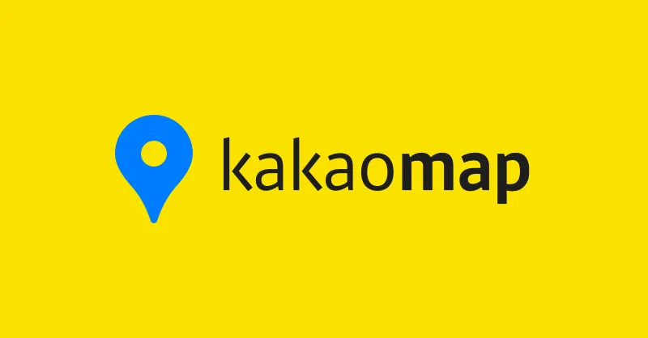

<!-- Level 3: Add custom code -->

# 👋 Hi there, I'm Luna!

<h2> <strong>🥰 Introduction</strong>  </h2>

- 🤩 Full name: <b>Do Hoang Huong Lien</b>

- 🎂 Date of birth: <b>2000/12/09</b>

- ✉️ E-Mail: <b>liendhhha140217@gmail.com</b>

- 📷 Instagram: <b>[Luna Do](https://www.instagram.com/lido_010209)</b>

- 🚀 Goal: <b>Full stack Web Developer</b>

<h2> <strong>🎓 Education</strong>  </h2>

- 👩🏻‍🎓 A Graduate Student at [Global Korean Studies](https://gks.sogang.ac.kr/english/) department of [Sogang University](https://www.sogang.ac.kr/ko/home)  
  > 
     

- 👩🏻‍💻 A Graduate Student at <b>Data Science</b> department of [Liverpool John Moores University](https://www.ljmu.ac.uk/). 
(Cyber program)

  > 
    

<h2> <strong>💭 Skills</strong>  </h2>

### <b>🤹‍♀️ Hard Skills</b>

- <i>🧰 Technical Skills</i>

    

- <i>🗣 Language Skills</i> 

  > - **English**: Fluent
  > - **Korean**: Daily conversation
  > - **Vietnamese**: Native
  > - **Japanese**: Daily conversation

  

### <b>🌸 Soft Skills</b>
> - <b>Time Management</b>
> - <b>Problem-solving</b>
> - <b>Adaptability</b>

## 💻 <b>Projects</b>

<h3><b>👨‍💻 Full Stack Web Application</b></h3>

### 1. Project Title: [Board & Article Web Application](https://github.com/lido010209/ktech-spring-project-2.git)

- **Technologies Used**
    > <b>Backend</b>: 
    >- **Java**: Programming language for backend logic.
    >- **Spring Boot**: Framework for building stand-alone, production-ready applications.
    >- **JPA (Java Persistence API)**: For mapping Java objects to database tables.
    >- **Spring MVC**: For handling HTTP requests and responses.

    > 
    > 
      

    > <b>Database</b>:
    >- **SQLite**: A lightweight database used for data storage.

    
    > 
      

    > **Frontend:**
    >- **HTML**: Markup language for structuring the web pages.
    >- **Bootstrap**: Framework for responsive design.
    >- **Canva**: Tool used for creating design elements.

    > 
    > 
    > 

    

- **Feature**
  1. **Boards:**
      - The application supports four different types of boards where articles can be categorized based on themes or topics.

  2. **Articles:**
      - Users can create, update, read, and delete articles (CRUD operations).
      - Each article can have multiple associated comments.

  3. **Comments:**
      - Users can create, delete, and read comments on specific articles (CRUD operations).
      - Each comment is linked to its respective article.

  4. **User Authentication for Editing:**
      - When creating an article or a comment, users must set up a password.
      - To edit or delete an article/comment, users must input the correct password for authentication, ensuring security and accountability.

### 2. Project Title: [Shopping Mall Web Application](https://github.com/lido010209/ktech-java-project-3.git)

- **Technologies Used**

  > **Backend:**
  >- **Java**: Programming language for backend development.
  >- **Spring Boot**: Framework for building scalable applications.
  >- **Spring Security**: For implementing security, including user authentication.
  >- **JWT (JSON Web Tokens)**: For secure token-based user authentication.

  > 
  > 

    

  > <b>Database</b>:
  >- **SQLite**: A lightweight database used for data storage.
  
  > 

    
  > Frontend:  
  >- **HTML**: Markup language for structuring web pages.
  >- **Bootstrap**: Framework for creating responsive and visually appealing designs.
  >- **JavaScript**: Programming language used for client-side scripting.
  >- **Fetch API**: JavaScript API used to make HTTP requests to the backend RESTful APIs.

    > 
    > 
    > 
    > 

      

  > **API Testing:**
  >- **Postman**: Tool used for testing the RESTful APIs to ensure functionality and reliability.

  >

    

- **Feature**
  1. **User Authentication:**
      - Secure user registration and login using JWT tokens for stateless authentication.
      - Password management with Spring Security for safeguarding user credentials.

  2. **Product Management:**
      - After logging in, users can order products available on the platform.
      - Sellers can request to open their own shops, which are subject to admin approval.

  3. **Shop Opening Request:**
      - Users can submit requests to open shops.
      - Admin reviews requests and approves or denies them based on established criteria.

  4. **Product Listing for Sellers:**
      - Approved sellers can register and manage their products for sale on the platform.

  5. **Order Management:**
      - Buyers can place orders for products.
      - Sellers can view and confirm payments for received orders.

  6. **Product Search Functionality:**
      - Users can search for products based on category, name, or see recently bought products.
      - The search functionality enhances user experience by providing relevant results.

  7. **RESTful API:**
      - Built the application with RESTful endpoints for managing users, products, and orders.
      - Ensures a consistent and clear API structure for frontend interaction.

  8. **Client-Side API Interaction:**
      - Utilized JavaScript's Fetch API to retrieve and send data between the client and server.
      - Implemented asynchronous requests to improve user experience during product searches, order placements, and shop management.

### 3. Project Title: [Seoul Travel Web Application]()

- **Technologies Used**

  > **Backend:**
  >- **Java**: Programming language for backend development.
  >- **Spring Boot**: Framework for building scalable applications.
  >- **Spring Security**: For implementing security, including user authentication.
  >- **JWT (JSON Web Tokens)**: For secure token-based user authentication.

  > 
  > 

    

  > **External APIs:**
  > - **Tour API**: To retrieve detailed information about Seoul's landmarks and attractions.
  > - **Naver Search API**: To enable users to search for addresses effectively.
  > - **Odsay API**: To obtain information about transportation routes, including paths, times, and fees.
  > - **NCloud Directions 5**: For generating car routes and navigation.
  > - **Kakao Login API**: For enabling user authentication via Kakao accounts.
  > - **Naver Login API**: For user authentication through Naver accounts.

  > 
  > 
  > 
  > 

     

  > <b>Database</b>:
  >- **MySQL**: An effective database used for data storage.
  
  > 

    
  > Frontend:  
  >- **HTML**: Markup language for structuring web pages.
  >- **Bootstrap**: Framework for creating responsive and visually appealing designs.
  >- **JavaScript**: Programming language used for client-side scripting.
  >- **Fetch API**: JavaScript API used to make HTTP requests to the backend RESTful APIs.
  >- **Kakao Map API**: For mapping functionality, including markers and route visualization.

    > 
    > 
    > 
    > 
    > 

      

  > **API Testing:**
  >- **Postman**: Tool used for testing the RESTful APIs to ensure functionality and reliability.

  >

     

- **Feature**
  1. **User Authentication:**
      - Secure user registration and login, with support for traditional login as well as third-party authentication via Kakao and Naver.
      - Users can choose to log in using their Kakao or Naver accounts for a seamless experience.

    2. **Landmark Information:**
        - Integration with the Tour API to fetch detailed information about popular landmarks and attractions in Seoul, including descriptions, images, and visitor details.

  3. **Address Searching:**
      - Utilization of Naver Search API to allow users to search for addresses easily, improving navigation and travel planning.

  4. **Transportation Route Information:**
      - Use of Odsay API to provide users with comprehensive transportation options, including the best routes, expected travel times, and fare information.

  5. **Car Route Navigation:**
      - Integration with NCloud Directions 5 to calculate and display driving routes, helping users plan their journeys effectively.

  6. **Dynamic Map Interface:**
    - Frontend developed using Kakao Map API that allows users to:
      - View landmarks on the map.
      - Define markers for various points of interest.
      - Display information about each place when hovered over or clicked.
      - Draw lines on the map according to the paths retrieved from the backend, showing routes and directions clearly.

<h3><b>👨‍💻 Machine Learning</b></h3>

### [Logistic Regression Model for Lead Conversion](https://github.com/lido010209/machine-learning.git)

- **Project Overview**

  - In this project, I developed a logistic regression model for X Education, an online education company, to improve their lead conversion process. Given the challenge of a low conversion rate (approximately 30%) from generated leads, the company aimed to identify 'Hot Leads'—those most likely to convert into paying customers. The goal was to enhance the efficiency of the sales team by focusing their efforts on leads with higher potential.

    > 
    > 

       

- **Methodology**
  1. **Data Understanding and Preparation:**
      - Conducted exploratory data analysis (EDA) to explore the dataset's characteristics and distributions.
      - Preprocessed the data by handling missing values, converting categorical variables into numerical formats, and normalizing continuous features where necessary.

  2. **Model Building and Evaluation:**
      - Built a logistic regression model to assign a lead score from 0 to 100 for each lead, predicting their likelihood of conversion.
      - Evaluated the model's performance using metrics such as accuracy, precision, recall, and the F1 score to ensure it met the business needs.

  3. **Adjustability for Future Requirements:**
      - Developed the model with considerations for potential future changes in the company's objectives, allowing for easy adjustments based on evolving data or requirements.

